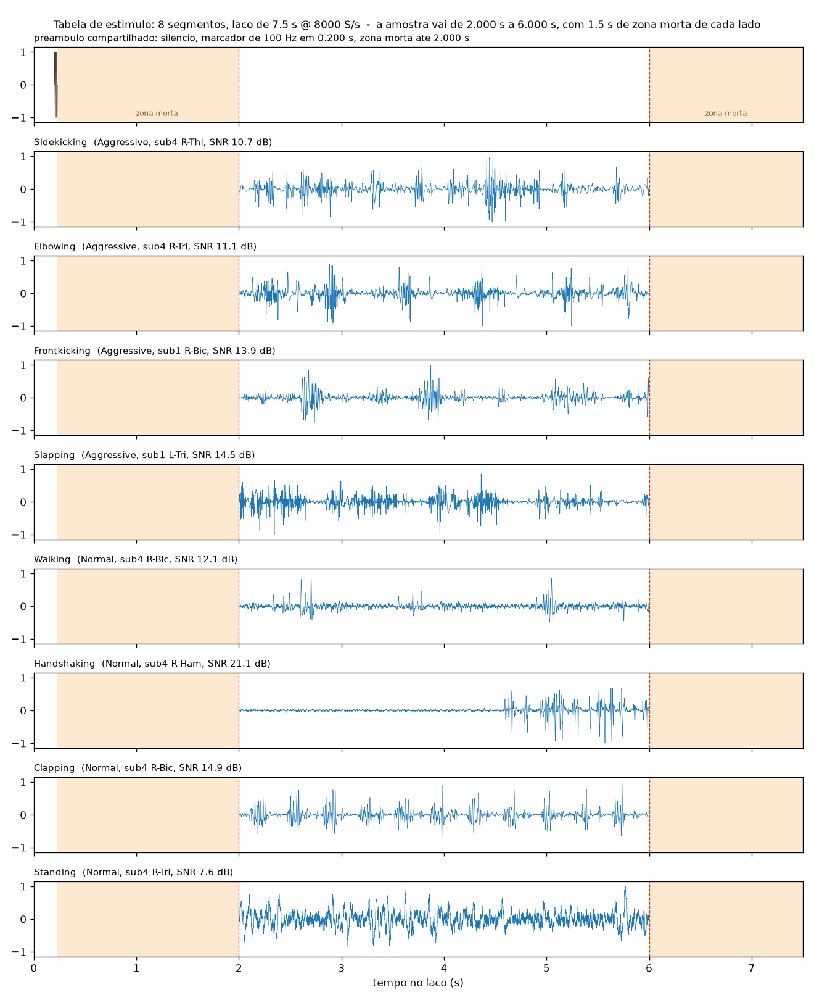

# stm32_dac_player — estímulo sEMG por DAC

Firmware para **NUCLEO-H563ZI** e **NUCLEO-F767ZI** que toca no DAC o trecho de
*sidekicking* do dataset do artigo, para os ensaios de qualidade de sinal
([TRES_ENSAIOS_SINAL.pdf](../TRES_ENSAIOS_SINAL.pdf) §3). A saída vai para o
[circuito de condicionamento](../CIRCUITO_CONDICIONAMENTO.pdf) (LM358 → 1:501 → 5,59 mV pp)
e de lá para a placa sEMG e para o EMG clínico.

A placa **liga e já toca o laço**. A CLI pela serial do ST-LINK e o botão azul
trocam de modo; no laboratório não precisa de PC.

## Ligação

| Sinal | Pino | Nucleo-144 (Zio) | Para onde |
|---|---|---|---|
| Estímulo (DAC canal 1) | **PA4** | CN7 pino 17 (D24) | J1 "DAC" do condicionamento |
| Sincronismo (DAC canal 2) | **PA5** | CN7 pino 10 (D13) | gatilho do osciloscópio (opcional) |
| Terra | GND | qualquer GND | GND comum da bancada |

O pinout é o Zio padrão das duas placas. Confira na serigrafia antes de soldar
(UM3115 para a H563ZI, UM1974 para a F767ZI). O LM358 do condicionamento é
alimentado em **5 V** (o pino 5V da Nucleo serve), não em 3,3 V.

O **sync** é um pulso de 10 ms (0 → 3,1 V) que começa na amostra 0 de cada laço
e de cada degrau da varredura. Ele sai pelo segundo canal do DAC, na mesma
palavra de DMA do estímulo, então cai na amostra exata, sem o jitter de um GPIO
acionado por interrupção. O alinhamento entre os três braços continua vindo do
marcador de 100 Hz, que está dentro do próprio sinal.

## Uso rápido

```powershell
python stm32_dac_player\tools\fetch_dataset.py     # baixa o dataset da UCI e confere o SHA-256
python stm32_dac_player\tools\make_stimulus.py     # (opcional) regera a tabela; a versionada já está pronta
powershell -File stm32_dac_player\tools\flash.ps1 -Board h563zi
```

O `flash.ps1` compila e copia o `.bin` para o drive USB que o ST-LINK monta
(`NOD_H563ZI` / `NODE_F767ZI`). Não é preciso instalar nada da ST. Se o
`STM32_Programmer_CLI` estiver no PATH, `-Programmer` usa ele no lugar.

Para só compilar: `powershell -File stm32_dac_player\tools\build.ps1 -Board f767zi`.

### Gravação via WSL (quando o drive do ST-LINK não monta)

Em máquina com política corporativa de bloqueio de armazenamento removível, o
drive USB do ST-LINK aparece no Windows mas dá "acesso negado" (confirmado
nesta máquina) — `flash.ps1` não funciona. Alternativa sem instalar nada da
ST, pela interface de debug (SWD) do ST-LINK via WSL:

```powershell
# uma vez: compartilha o ST-LINK com o WSL (pede UAC)
usbipd bind --busid <busid-do-ST-LINK>      # usbipd list mostra o busid (VID 0483:374e)
usbipd attach --wsl --busid <busid>         # sem admin; repetir depois de reboot/replug
# ou: powershell -File stm32_dac_player\tools\wsl_attach_stlink.ps1
```
```bash
# dentro do WSL (uma vez): pyocd + o pacote CMSIS do alvo
pip3 install --user --break-system-packages pyocd
pyocd pack install stm32h563zitx      # ou stm32f767zitx

# a cada gravação
sudo chmod 666 /dev/bus/usb/001/00X   # ache o numero com `lsusb` (STMicroelectronics STLINK-V3); so dura até replugar
pyocd flash -t stm32h563zitx build/h563zi/stm32_dac_player_h563zi.bin --base-address 0x08000000
pyocd reset -t stm32h563zitx
```

A serial também passa para o WSL (`/dev/ttyACM0`), com o mesmo `chmod 666` ou
`sudo` se o usuário não estiver no grupo `dialout`. `usbipd bind` fica
persistido; só o `attach` precisa ser refeito depois de um reboot, sleep ou
desconectar o cabo (sem UAC).

**Pré-requisitos** (uma vez só):
- [Arm GNU Toolchain](https://developer.arm.com/downloads/-/arm-gnu-toolchain-downloads) 14.x para mingw-w64, extraída em `%USERPROFILE%\tools\arm-gnu-toolchain\`. Outro lugar funciona com `ARM_TOOLCHAIN_DIR`.
- `pip install --user cmake ninja`. Os scripts usam numpy, scipy, matplotlib e pyserial.

## Modos e comandos

Serial: porta do ST-LINK, 115200 8N1. `help` lista tudo.

| Comando | O que faz | Uso no ensaio |
|---|---|---|
| `loop` | laço de estímulo, recomeçando da amostra 0 (**modo de boot**) | E3 |
| `once` | toca o laço uma vez e para em silêncio | disparo sob comando |
| `sweep` | degraus de 1/3 de oitava, 10,0 → 794,3 Hz (20 degraus, IEC 61260 base 10), 2 s cada | E1 passo 6, E3 passo 7 |
| `sine <Hz>` | senoide fixa | E1 passos 2–4 |
| `silence` | meia escala, parado | E1 passo 5, E3 passo 3 |
| `code <n>` | código DC fixo | conferir o DAC no multímetro |
| `amp <n>` / `amp 1400mv` / `amp -20db` | amplitude de pico em códigos, mV na saída do DAC ou dBFS (0 dB = 2047) | E1 passos 2 e 4 |
| `mid <n>` | código do centro (padrão 2048) | |
| `status` / `info` | modo e amplitude / placa, relógio, tabela, SHA-256 e CRC | caderno de bancada |
| `events on` | imprime cada início de laço ou degrau | |

A amplitude padrão é **1738 códigos = ±1,400 V** (85 % dos códigos, TRES_ENSAIOS §2).
Trocar a amplitude não recomeça o laço; trocar de modo recomeça.

- **Botão azul:** loop → sweep → sine 100 Hz → silence → loop.
- **LED verde:** aceso = loop, 2 Hz = sweep, 1 Hz = sine, 4 Hz = once tocando, apagado = silêncio.
- **LED vermelho:** algo errado. Ou o HSE não subiu (caiu no HSI, base de tempo ±1 %, não serve para ensaio), ou o CRC da tabela não confere, ou houve underrun de DMA. O `info` diz qual.

`tools/player_cli.py` manda comandos por script. `--linearity` faz o passo 4
do E1: dez amplitudes de −40 a −3 dBFS, com o instante de cada troca.

## O laço de estímulo (6,5 s @ 8 kS/s, 104 kB)

| Intervalo | Conteúdo | Para quê |
|---|---|---|
| 0,0–0,5 s | silêncio | piso de ruído medido de cada braço |
| 0,5 s | 3 ciclos de 100 Hz (30 ms) | marcador de alinhamento por correlação cruzada |
| 0,8–1,3 s | silêncio | |
| 1,3–1,8 s | chirp linear 20 → 500 Hz | verificação rápida de banda |
| 1,8–2,3 s | silêncio | |
| 2,3–6,3 s | trecho do dataset, pico normalizado a ±1,0 | o sinal do ensaio |
| 6,3–6,5 s | silêncio | → repete |



A tabela é gerada offline por [`tools/make_stimulus.py`](tools/make_stimulus.py):
- a média é removida;
- reamostragem de 1 kS/s para 8 kS/s com `scipy.signal.resample_poly`;
- rampas de 10 ms nas bordas;
- o pico é normalizado depois de reamostrar.

O script grava a tabela em [`common/stimulus_table.c`](common/stimulus_table.c), mais a
referência amostra a amostra para a análise ([`stimulus/stimulus_loop.csv`](stimulus/stimulus_loop.csv), `.wav`) e os parâmetros com o hash em
[`stimulus/stimulus.json`](stimulus/stimulus.json).

**Tabela atual:** SHA-256 `b145c17c2bcf125bee1cda7f18b5bb8a801dec087caec36a2e58aea1dbdb2570`, CRC32 `0xcb4abf10`.
O `info` mostra os dois e confere o CRC na flash a cada boot. Anote o SHA no
caderno de bancada. Regerar a tabela invalida a comparação entre sessões.

## Qual trecho do dataset, e por quê

**Dataset:** UCI *EMG Physical Action Data Set* (Theodoridis 2011, DOI 10.24432/C53W49, ref. [22] do artigo).
É um Delsys de 8 canais. *Não* é Trigno: o Trigno aparece no artigo só como referência de consumo.

Três fatos não estão no readme da UCI; foram verificados nos arquivos:
- a taxa é **1000 S/s** (os `.log` têm Start/End: cerca de 9 800 amostras em 9 s);
- a unidade é µV;
- o sinal ceifa em ±4000 µV.

**O trecho exato da Fig. 5 não é recuperável.** O envelope da figura foi
digitalizado e correlacionado com todas as janelas de 4 s de todos os 80
arquivos × 8 canais, em quatro escalas de tempo. Nada passou de r = 0,66, que é
nível de acaso: o "Original Signal" do artigo foi pré-processado de um jeito que
não ficou registrado. Por isso a escolha é por critério, reprodutível em
[`tools/pick_segment.py`](tools/pick_segment.py):

1. Sidekicking, só canais de perna.
2. No máximo 0,5 % de amostras ceifadas.
3. Entre 8 e 18 rajadas pelo método do artigo.
4. SNR pelo método do artigo (envelope RMS de 50 ms, limiar de 20 %) mais perto
   dos **10,7 dB** publicados para o sinal original.

**Escolhido: sub4, coluna 4 (R-Thi, coxa direita), 4,90–8,90 s.** SNR de
10,66 dB, 15 rajadas e 0,15 % ceifado. É a única janela de perna do
Sidekicking que fica dentro do limite de ceifamento, fora do sub2 (que a UCI
marca como não filtrado). Os reservas estão em
[`stimulus/candidates.png`](stimulus/candidates.png). Para trocar:
`make_stimulus.py --subject 3 --channel L-Thi --start 4.75`.

Se as gravações brutas da sessão de 2025 aparecerem
(ver [ENSAIOS_ARTIGO_2.md](../ENSAIOS_ARTIGO_2.md)), dá para reabrir esta escolha.

## Como funciona

```
TIM6 TRGO 8 kHz ──► DAC canal 1 (PA4)  ◄── DHR12RD ◄── DMA circular ◄── pingue-pongue 2 × 256 palavras
                └─► DAC canal 2 (PA5)                    (meia janela = 32 ms)   ▲
                                                                                 │ player_fill()
                                              interrupção HT/TC ─────────────────┘ tabela / senoide / varredura
```

- A temporização é toda de hardware. A CPU só preenche a metade do buffer que o DMA acabou de esvaziar.
- A CLI e o botão postam pedidos que entram na próxima meia janela, sem trava e sem cortar amostra.
- No H5, o GPDMA conta blocos de no máximo 64 kB. Por isso o modo circular é um item de lista encadeada que aponta para si mesmo.
- **Relógio:** HSE em bypass no MCO de 8 MHz do ST-LINK. H563 a 250 MHz (TIM6 com ARR = 31249); F767 a 216 MHz (timers do APB1 a 108 MHz, ARR = 13499). As duas contas são exatas para 8 kS/s.

| Pasta | Conteúdo |
|---|---|
| `common/` | portável: `player.c` (modos), `cli.c`, `main.c`, `board.h` (interface), tabela gerada |
| `boards/h563zi/`, `boards/f767zi/` | `board.c` por registrador sobre os headers CMSIS, startup e linker script da ST |
| `vendor/` | subconjunto dos headers CMSIS da ST (cmsis-core, cmsis-device-h5 `884b8dc`, cmsis-device-f7 `2352e88`), licenças junto |
| `tools/` | dataset, escolha do trecho, geração da tabela, build/flash, CLI por script |
| `tests/` | teste de host do player e da CLI: `python stm32_dac_player/tests/run_host_tests.py` (precisa de `pip install ziglang`) |

O teste de host confere amostra a amostra, contra a tabela, dois laços inteiros
e a posição exata do sync. Também cobre o `once`, a frequência de 12 degraus da
varredura, a amplitude da senoide e o parser da CLI.

## Verificação na bancada (H563ZI)

1. `info`: o SHA bate com `stimulus/stimulus.json`, o CRC dá `OK` e o relógio aparece como `HSE`.
2. `silence` com multímetro em PA4: cerca de 1,65 V.
3. `sine 100`, multímetro em AC na saída do seguidor. Ajuste `amp` até ±1,400 V de pico (≈ 0,990 V RMS) e anote o código. Esperado: perto de 1738.
4. Sync no osciloscópio: período de **6,500 s** no `loop` e de 2,000 s no `sweep`.
5. Botão cicla os modos, e o LED verde acompanha.

### Estado da bancada (2026-10-06)

Gravada pela via WSL/pyocd acima (o drive do ST-LINK não monta nesta
máquina). Confirmado pela serial:

```
board    NUCLEO-H563ZI  SYSCLK 250 MHz  clock HSE (MCO 8 MHz do ST-LINK)
crc32    esperado cb4abf10 calculado cb4abf10  OK
```

`sine 100` e `sweep` responderam certo (degrau avançou 10,00 → 12,59 Hz nos
2 s esperados). **Os passos 2–4 acima (amplitude no multímetro, período no
osciloscópio) ainda não foram feitos** — exigem instrumento físico na
bancada. A placa ficou em `loop`, tocando sem parar (120 laços em 794 s de
uptime na última checagem), pronta para o Ensaio 3 de manhã.

**Para a sessão de amanhã (E3 — dataset × clínico × placa, osciloscópio):**
checklist completo em [TRES_ENSAIOS_SINAL.pdf](../TRES_ENSAIOS_SINAL.pdf) §E3.
Resumo do que falta montar: circuito de condicionamento
([CIRCUITO_CONDICIONAMENTO.pdf](../CIRCUITO_CONDICIONAMENTO.pdf)) entre PA4 e
os terminais de injeção dos dois sistemas, LM358 em 5 V, osciloscópio como
único terra da bancada (notebook na bateria, USB da placa sEMG desconectado),
e o sync do PA5 no segundo canal do osciloscópio para disparo. Antes de
gravar: `silence` nos dois braços de hardware por 30 s e comparar com o piso
medido em casa (E1 passo 5) — se estiver pior, é laço de terra do
laboratório, resolver antes de gravar.
